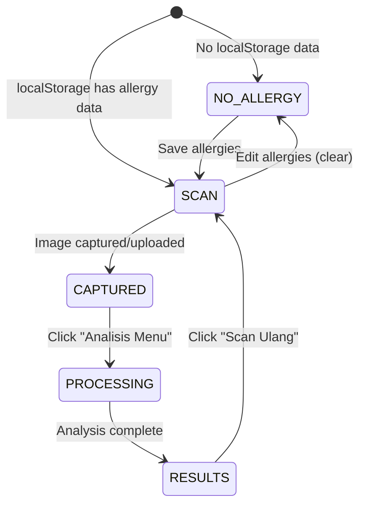

# AI Allergen Menu Scanner — Implementation Plan

Build a production-ready, mobile-first web app for scanning restaurant menus and detecting allergen risks, using a state-machine-driven single-page architecture on Next.js 16 + Tailwind v4.

## User Review Required

> [!IMPORTANT]
> **AI Backend**: The current plan mocks the AI analysis with a simulated API route (`/api/analyze`). You'll need to connect it to your actual AI model (e.g., Gemini, OpenAI Vision) later. The mock returns realistic sample data for UI development.

> [!IMPORTANT]
> **Single Page Architecture**: The entire app lives on a single route (`/`) with client-side state management. No Next.js routing is used — the state machine handles all screen transitions. This keeps the UX instant and avoids page load delays.

---

## Design System

| Token | Value | Usage |
|-------|-------|-------|
| Primary | `#0891B2` | Teal — medical/health trust |
| Primary Light | `#22D3EE` | Hover states, accents |
| Danger | `#FF4D4F` | High risk allergen |
| Caution | `#FFC53D` | Moderate risk |
| Safe | `#52C41A` | No allergen detected |
| Background | `#F0FDFA` | Page background |
| Surface | `#FFFFFF` | Card backgrounds |
| Text Primary | `#134E4A` | Headings, body |
| Text Muted | `#5F7A76` | Secondary text |
| Fonts | Figtree (headings) + Noto Sans (body) | Medical/clean/accessible |

---

## State Machine

---

## Proposed Changes

### Design System & Layout

#### [MODIFY] [globals.css](file:///Users/jefripunza/Documents/Projects/skripsi/food-lens-ai/app/globals.css)
- Replace default styles with complete design system
- Custom properties for all colors, shadows, border-radii
- Tailwind v4 `@theme inline` tokens
- Animations: fade-in, slide-up, pulse-scan, shake, flash
- `prefers-reduced-motion` media query respected

#### [MODIFY] [layout.tsx](file:///Users/jefripunza/Documents/Projects/skripsi/food-lens-ai/app/layout.tsx)
- Switch fonts to Figtree + Noto Sans via `next/font/google`
- Update metadata: title, description, viewport for mobile
- Set `lang="id"` (Indonesian language)
- Add PWA-ready meta tags

---

### Core Application

#### [MODIFY] [page.tsx](file:///Users/jefripunza/Documents/Projects/skripsi/food-lens-ai/app/page.tsx)
- Complete rewrite as client component with state machine
- `AppState` enum: `ALLERGY_INPUT | SCAN | CAPTURED | PROCESSING | RESULTS`
- localStorage read on mount → auto-skip to SCAN if allergy data exists
- Orchestrates all screen transitions

---

### Components

#### [NEW] [AllergyInput.tsx](file:///Users/jefripunza/Documents/Projects/skripsi/food-lens-ai/app/components/AllergyInput.tsx)
- Friendly headline: "Apa saja yang membuat kamu alergi?"
- Auto-growing textarea with smart placeholder
- Tap-to-fill example chips (kacang, susu, udang, gluten, telur, kedelai)
- Inline validation (empty state warning)
- Save to localStorage → transition to SCAN

#### [NEW] [ScanScreen.tsx](file:///Users/jefripunza/Documents/Projects/skripsi/food-lens-ai/app/components/ScanScreen.tsx)
- Tab switcher: Kamera (default) | Upload
- **Camera tab**: Auto-init getUserMedia, live preview, rectangle guide overlay, capture button with flash effect
- **Permission handling**: Allowed → show camera; Denied → friendly fallback card; Loading → skeleton shimmer
- **Upload tab**: Drag & drop zone, file input
- Edit Alergi button in top bar
- Sticky "Analisis Menu" button (disabled until image)

#### [NEW] [ProcessingScreen.tsx](file:///Users/jefripunza/Documents/Projects/skripsi/food-lens-ai/app/components/ProcessingScreen.tsx)
- Scanning line animation
- Progress text: "Menganalisis menu & mendeteksi alergen..."
- Micro-copy: "Biasanya < 3 detik"
- Locked UI — no escape during processing

#### [NEW] [ResultsScreen.tsx](file:///Users/jefripunza/Documents/Projects/skripsi/food-lens-ai/app/components/ResultsScreen.tsx)
- Scrollable food card list with staggered fade-in
- Each card: food name, description, risk badge (icon + color + label), explanation box, allergen icons, AI confidence %
- Risk levels: 🔴 Risiko Tinggi, 🟡 Perlu Hati-hati, 🟢 Aman (using SVG icons, not emoji)
- Sticky "Scan Ulang" button → back to SCAN

#### [NEW] [Icons.tsx](file:///Users/jefripunza/Documents/Projects/skripsi/food-lens-ai/app/components/Icons.tsx)
- SVG icon components (per skill rules — no emojis as UI icons)
- Icons: Camera, Upload, Warning, Check, Shield, Peanut, Milk, Shrimp, Wheat, Edit, Scan, ChevronLeft, AlertTriangle

---

### API

#### [NEW] [route.ts](file:///Users/jefripunza/Documents/Projects/skripsi/food-lens-ai/app/api/analyze/route.ts)
- POST endpoint accepting image as base64
- Mock response with realistic food analysis data
- Returns array of food items with: name, description, risk level, allergens detected, explanation, confidence score

---

## Verification Plan

### Automated Tests
- Build check: `yarn build` to verify no TypeScript/compilation errors
- Visual verification via browser subagent at `localhost:3000`

### Manual Verification (Browser)
1. First load → Allergy Input screen appears
2. Enter allergies → transitions to Scan screen
3. Camera permission flow works correctly
4. Upload flow works correctly
5. "Analisis Menu" button enables after capture
6. Processing animation plays
7. Results show with correct risk levels and explanations
8. "Scan Ulang" returns to Scan screen with camera active
9. Reload → auto-skips to Scan (localStorage persists)
10. Mobile responsive at 375px width
